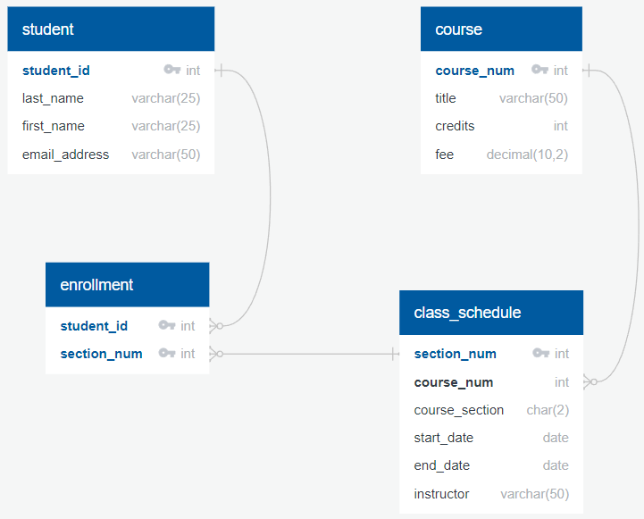

# Create a Database Demo

## Overview
In this demo, we will create the simplified version of the University database discussed in the day 1_Introduction and 3_Relational_Database lectures. We will be using pgAdmin 4 for PostgreSQL. It is highly recommended that you use the open source PostgreSQL packages and installers from EDB to install **PostgreSQL Version 16.4 or higher**. Click [here](https://www.enterprisedb.com/downloads/postgres-postgresql-downloads) to go to the downloads page and follow the instructions to download and install for your operating system.

{: .note }

As of September 2024, EDB has made a 17.RC1 (release candidate) version publicly available. You should be fine if you already installed this version but if not, it is recommended to install the latest version of 16.4.

## Introduction to PostgreSQL
[PostgreSQL](https://www.postgresql.org/about/) is a powerful, open source object-relational database system that uses and extends the SQL language combined with many features that safely store and scale the most complicated data workloads. The origins of PostgreSQL date back to 1986 as part of the POSTGRES project at the University of California at Berkeley and has more than 35 years of active development on the core platform.

{: .important-title }
> Did you know that Amazon Redshift, a popular cloud relational database developed by Amazon, is a fork of PostgreSQL?

## Create a new Database
Open **pgAdmin 4** and then navigate to your PostgreSQL 16 server group, right/secondary click on it and select Create > Database. Name the Database `university` and click on Save.


## Implementation Steps
Before we start to create the database tables, let's review the conceptual ERD to plan out our implementation steps for the database.


<div style="page-break-after: always;"></div>

1. The `student`, `course` and `class_schedule` entities will become tables in the database.
2. The M:N relationship between `student` and `class_schedule` will require a new table in the database that we will call `enrollment`.  
   a. The new `enrollment` table will need two foreign keys referring to the primary keys in `student` and `class_schedule`. 
3. The foreign key between `class_schedule` and `course` will need to be added on the `class_schedule` side since this is the many side.
4. The key attributes will become the primary keys in all tables.
5. No composite or multi-valued attributes in this simple database.

## Option 1 - Create Table SQL Statements
In this option, we will be writing the SQL statements to create tables named `student`, `course`, `class_schedule`, and `enrollment`.

### Some Thoughts on Naming Conventions
If you do any amount of research on the web about best practices for table and column naming conventions, the main thing that you will discover is there does not seem to be any consistent recommendations. Should you use a `snake_case`, `camelCase`, or `PascalCase` naming convention? Should you use singular or plural nouns? The latter seems to be a pretty highly debated topic. Check out this [Stack Overflow post](https://stackoverflow.com/questions/338156/table-naming-dilemma-singular-vs-plural-names) where it seems almost every other answer/comment contradicts each other. 

**Here are two general rules to consider:**

1. Be consistent
2. Avoid names that conflict with applicable DBMS [reserved words](https://en.wikipedia.org/wiki/List_of_SQL_reserved_words)

In line with rule #1 above, we will use `snake_case` throughout this course and favor singular nouns unless it just sounds weird when you say it out loud or it violates rule #2. Click [here](https://www.baeldung.com/sql/database-table-column-naming-conventions) to read a little more about naming conventions.

<div style="page-break-after: always;"></div>

### Create the `student` Table
Click on the Execute SQL tab and the default SQL 1 tab. Copy the SQL code below and paste into the new query file.

``` sql
CREATE TABLE student (
  student_id int NOT NULL, 
  last_name varchar(25) NOT NULL, 
  first_name varchar(25) NOT NULL, 
  email_address varchar(50) NOT NULL, 
  CONSTRAINT student_pk PRIMARY KEY(student_id)
);
```
Click on the black triangle to execute the code and create the new table.

{: .tip }

Use the F5 key on your keyboard as a shortcut to execute code in pgAdmin. For the rest of this lab, we will simply just say "execute the code" and you can use the method that you prefer.

What happens if you try to execute the code again?

{: .warning }

You will get an Execution error because the table already exists. We will discuss ways to avoid this later in this demo.

### Create the `course` Table
Copy/write the SQL code below and paste below the `CREATE TABLE student` code in the same query file.

``` sql
CREATE TABLE course (
  course_num int NOT NULL,
  title varchar(50) NOT NULL,
  credits int NOT NULL CHECK (credits > 0),
  fee decimal(10,2) NOT NULL,
  CONSTRAINT course_pk PRIMARY KEY(course_num)
);
```
Select **only** the code to create the `course` table and execute the code to create the new table.

{: .note }

Most database tools such as pgAdmin default to only run the selected code. This combined with using a keyboard shortcut is something you will use very frequently in practice!

### Create the `class_schedule` Table
Copy/write the SQL code below and paste below the `CREATE TABLE course` code in the same query file.

``` sql
CREATE TABLE class_schedule (
  section_num int NOT NULL, 
  course_num int NOT NULL, 
  course_section char(2) NOT NULL, 
  start_date date NOT NULL, 
  end_date date NOT NULL, 
  instructor varchar(50) NOT NULL, 
  CONSTRAINT class_schedule_pk PRIMARY KEY(section_num), 
  CONSTRAINT class_schedule_course_fk FOREIGN KEY (course_num) REFERENCES course(course_num)
);
```
Select **only** the code to create the `class_schedule` table and execute the code to create the new table.

### Create the `enrollment` Table
Copy/write the SQL code below and paste below the `CREATE TABLE class_schedule` code in the same query file.

``` sql
CREATE TABLE enrollment (
  student_id int NOT NULL, 
  section_num int NOT NULL, 
  CONSTRAINT enrollment_pk PRIMARY KEY (student_id, section_num), 
  CONSTRAINT enroll_student_fk FOREIGN KEY (student_id) REFERENCES student(student_id), 
  CONSTRAINT enroll_course_fk FOREIGN KEY (section_num) REFERENCES class_schedule(section_num)
);
```
Select only the code to create the `enrollment` table and execute the code to create the new table. We saw earlier that we cannot create a table if it already exists so we cannot run the entire query without getting an execution error. Let's address that now by adding some `DROP TABLE` statements.

### Add Drop Table Statements
One option is you include a `DROP TABLE IF EXISTS` statement right above each CREATE TABLE statement.

{: .warning }

You will get an Execution error because you cannot drop the `student` table since the `enrollment` table references it in the `FOREIGN KEY` constraint.

 One way to solve for this is to include DROP TABLE IF EXISTS statements at the top but order them in a way that it drops tables with `FOREIGN KEY` constraints first. Copy/write the SQL code below and paste at the top of the script.

``` sql
DROP TABLE IF EXISTS enrollment;
DROP TABLE IF EXISTS class_schedule;
DROP TABLE IF EXISTS course;
DROP TABLE IF EXISTS student;
```
These statements will drop all of the tables if they already exist.

{: .tip }

The `CASCADE` parameter in the `DROP TABLE` statement will automatically drop objects that depend on the table but this is one example of SQL functionality that only exists in some relational database systems.


### Create ERD in pgAdmin
Now that we have a database with all of the tables and constraints, we can reverse engineer the ERD from the logical database. Right/Secondary click on the `university` database and select ERD for Database. This will create a new tab with an ERD. You can rearrange the entities around for a cleaner organization of the ERD.


## Option 2 - Create an ERD with Export SQL Option

Many web apps such as [QuickDBD](https://app.quickdatabasediagrams.com/) allow you to draw database diagrams by typing using proprietary syntax. Typically you would want to pick an app that also offers export functionality to automatically generate your `CREATE TABLE` statements. 

Click [here](https://youtu.be/dR5lPbGLY84?si=Cc-yp9RMyE2KShfd) to watch a video on an Overview of QuickDBD.

<div style="page-break-after: always;"></div>

### Create New Diagram

Go to [QuickDBD](https://app.quickdatabasediagrams.com/). Click on File -> Load Sample Diagram to load the sample to get a general idea of the QuickDBD syntax. You can also copy and paste the code to a text file or notebook for easy reference later.

{: .tip }

Creating an account with QuickDBD will allow you to save your diagram as well as share and collaborate with others. A **Pro Account** is required to save more than one diagram but you can always save the diagram code to your computer and paste into a blank diagram as needed.

### Create the `student` Entity

Copy/write the code below and paste into the blank file.

```
student
-
student_id PK int
last_name varchar(25)
first_name varchar(25)
email_address varchar(50)
```
We now have a `student` entity on the diagram.


<div style="page-break-after: always;"></div>

### Create the `course` Entity

Copy/write the code below and paste below the `student` code in the same blank file.

```
course
-
course_num PK int
title varchar(50)
credits int
fee decimal(10,2)
```

We now have a `course` entity on the diagram. Since the student and course entities do not have a relationship, QuickDBD may place the `course` entity right next to the `student` entity but you can rearrange them as desired.


### Create the `class_schedule` Entity

We know from our implementation steps that the class_schedule table is going to require a FK reference. in QuickDBD, here are all of the symbols for the allowed relationships:

```
-     - one TO one  
-<    - one TO many  
>-    - many TO one  
>-<   - many TO many  
-0    - one TO zero or one  
0-    - zero or one TO one  
0-0   - zero or one TO zero or one  
-0<   - one TO zero or many  
>0-   - zero or many TO one  
```
The relationship between class_schedule to course is N:1. A course must exist to be on the schedule but not all courses must be on the schedule so we will use zero or many TO one. Copy/write the code below and paste below the `course` code in the same blank file.

```
class_schedule
-
section_num PK int
course_num int FK >0- course.course_num
course_section char(2)
start_date date
end_date date
instructor varchar(50)
```

We now have a `class_schedule` entity on the diagram and you may also want to rearrange them as desired.


{: .note }

Pay close attention to the `FOREIGN KEY` syntax next to the `course_num` attribute.

### Create the `enrollment` Entity

Copy/write the code below and paste below the `class_schedule` code in the same blank file.

```
enrollment
-
student_id PK int FK >0- student.student_id
section_num PK int FK >0- class_schedule.section_num
```


<div style="page-break-after: always;"></div>

### Export to SQL File

We are now ready to export the diagram to a SQL file with the `CREATE TABLE` statements. Click on EXPORT and choose PostgreSQL.

{: .note }

QuickDBD does not include `DROP TABLE IF EXISTS` statements and also uses the `ALTER TABLE` statement to add the `FOREIGN KEY` constraints after creating the tables. In addition, QuickDBD does not have syntax to add any `CHECK` constraints so make sure to add those to any relevant columns after downloading the SQL file.

## Conclusion

In this demo, we reviewed how to create a database and ERD by writing CREATE TABLE SQL statements manually and then reverse engineering the ERD in pgAdmin as well as used an ERD diagramming tool with export to SQL functionality to generate the necessary SQL statements.


