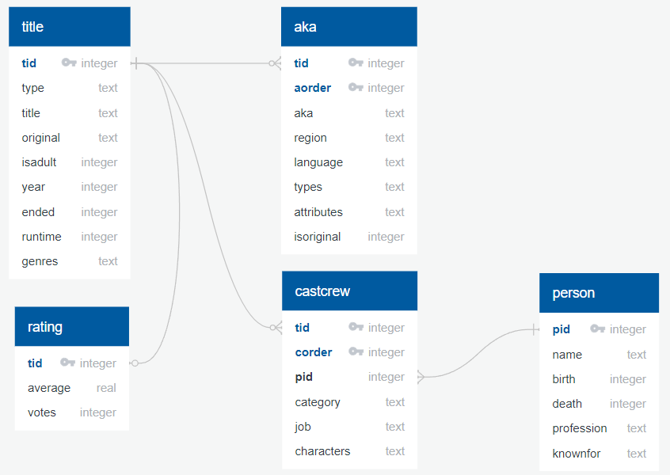
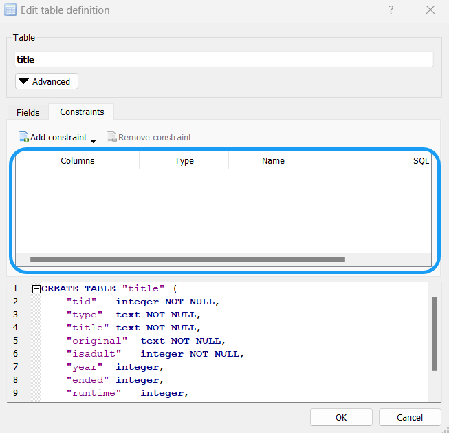

# Introduction to SQLite

In this demo, we will get some hands-on practice with basic SQL concepts and learn about SQLite, the [most used](https://www.sqlite.org/mostdeployed.html) database engine in the world. SQLite is a lightweight relational database engine that is often used for small and/or embedded databases because it doesn't require a separate server process and is easy to integrate into applications. The entire database including all of the tables, indices, and the data itself is stored in the database file on your computer. SQLite is highly portable and many desktop applications and mobile apps use it to store their data.

## Part 1: Movie Database

In homework 4, you will be working with an interesting movie dataset made available by [GroupLens](https://grouplens.org/) which has been collected from the [MovieLens](https://movielens.org/) website. In this demo though, we will work with a smaller movie dataset from [IMDb.com](https://www.imdb.com/).

## Part 2: Install DB Browser

To follow along, you will need to install [DB Browser](https://sqlitebrowser.org/), an app used for working with SQLite database files. Click [here](https://sqlitebrowser.org/dl/) to go to the DB Browser downloads page and follow the instructions to download and install the version for your operating system.

## Part 3: Download IMDb Database

In this demo, we utilize a medium sized SQLite database that primarily covers titles from 2015 to 2021. Click [here]([TBD](https://drive.google.com/file/d/1sAZsrpp8JmLeNhQ7Hz09HR5-mXesuCkw/view?usp=sharing)) to download the database file.

{: .tip }

In this demo, we will be executing DML statements to modify data in the database. Recommend you keep one copy of the original database in a different location on your computer so you can recover if needed.

<div style="page-break-after: always;"></div>

Open the file with DB Browser and click on "Browse Data" to explore the data:


You should see the following five tables:

| Table        | Description                                   | Rows       |
|:-------------|:----------------------------------------------|:-----------|
| `title`      | Movies, Shorts, TV series, Video games, etc.  | 484,420    |
| `aka`        | "also known as" – in other regions/languages  | 780,347    |
| `rating`     | IMDb ratings (voted by users) for some titles | 105,856    |
| `castcrew`   | People/characters that are in which titles    | 2,786,868  |
| `person`     | Actors, Composers, Producers, Writers, etc.   | 1,382,189  |

<div style="page-break-after: always;"></div>

### How is the data organized?

Below is the ERD for the IMDb database created on [QuickDBD](https://app.quickdatabasediagrams.com/).



{: .acknowledgment }

The original version of this data came from [IMDb Non-Commercial Datasets](https://developer.imdb.com/non-commercial-datasets/).

## Part 4: Let's Write Some SQL

Click on the "Execute SQL tab in DB Browser.


<div style="page-break-after: always;"></div>

### Example #1: Find a person

Tom Cruise recently brought some movie magic to the [2024 Paris Olympics closing ceremony](https://www.yahoo.com/entertainment/tom-cruises-olympics-closing-ceremony-stunt-took-over-1-year-to-plan-heres-how-it-came-together-160838336.html). Let's search for Tom in the `person` table.

``` sql
SELECT *
FROM person
WHERE name = 'Tom Cruise'
```
Here is the output:


He still pulls off all of those stunts at age 62!

### Example #2: Find all movies for an actor

We now know that Tom's `pid` in the database is `129` so let's search the `castcrew` table to see how many movies Tom has in the database.

``` sql
SELECT *
FROM castcrew
WHERE pid = 129
```
<div style="page-break-after: always;"></div>

Here is the output:


OK, Tom has appeared in 54 titles in the database. Let's narrow that down to just movies that he was an actor in the cast.

``` sql
SELECT *
FROM castcrew
WHERE pid = 129
and category = 'actor'
```
<div style="page-break-after: always;"></div>

Here is the output:


### Example #2: Find a movie

Let's check out movie `tid` "9603212" in the `title` table.

``` sql
SELECT *
FROM title
WHERE tid = 9603212
```
Here is the output:


Wait, if you go to the [Mission: Impossible - Dead Reckoning Part One](https://www.imdb.com/title/tt9603212) page, Mission Impossible 7 came out in 2023? 


{: .note }

We have not covered SQL JOINS yet so in this demo we will continue along just writing some basic SQL statements.

### Example #3: Update a movie

Let's update the database and set the year to **2023** and the runtime to **163** for 2h 43m.

``` sql
UPDATE title
SET year = 2023, runtime = 163
WHERE tid = 9603212
```
Here is the execution summary:

``` 
Execution finished without errors.
Result: query executed successfully. Took 0ms, 1 rows affected
At line 23:
UPDATE title
SET year = 2023, runtime = 163
WHERE tid = 9603212
```
{: .note }
DDL operations will not have any tabular output like DQL operations but you can confirm if the operation ran successfully and how many rows were affected in the section below the grid output.

<div style="page-break-after: always;"></div>

### Example #4: Insert a rating

Since Mission Impossible 7 had not come out yet when it was added to the database, let's also add the average rating and votes.

``` sql
INSERT INTO rating (tid, average, votes)
VALUES (9603212, 7.7, 260000)
```
Here is the execution summary:

```
Execution finished without errors.
Result: query executed successfully. Took 3ms, 1 rows affected
At line 28:
INSERT INTO rating (tid, average, votes)
VALUES (9603212, 7.7, 260000)
```
### Example #5: Find movies using a logical operator

Let's search for all movies that start with `Mission: Impossible`.

``` sql
SELECT *
FROM title
WHERE title like 'Mission: Impossible%'
```
Notice the wildcard character `%` usage at the end of the line but not the beginning? This makes sure the query only returns movies that start with Mission..

Here is the output:


OK, so all of the Mission Impossible movies reflect the release title but it looks like our database was created when Mission Impossible 7 and 8 had only been announced but no official titles yet. Let's also update `the` title from "Mission: Impossible 7" to "Mission: Impossible - Dead Reckoning Part One". I'm not aware of title change other than the "7" placeholder so we will go ahead and update the `original` title as well.

``` sql
UPDATE title
SET title = 'Mission: Impossible - Dead Reckoning Part One',
original = 'Mission: Impossible - Dead Reckoning Part One'
WHERE tid = 9603212
```
Here is the execution summary:

``` 
Execution finished without errors.
Result: query executed successfully. Took 0ms, 1 rows affected
At line 42:
UPDATE title
SET title = 'Mission: Impossible - Dead Reckoning Part One',
original = 'Mission: Impossible - Dead Reckoning Part One'
WHERE tid = 9603212
```

### Example #6: Delete a movie

According to IMDb, [Mission: Impossible 8](https://www.imdb.com/title/tt9603208) is in post-production and scheduled to be released in 2025. Let's delete that movie from the `title` table.

``` sql
DELETE FROM title WHERE tid = 9603208
```
Here is the execution summary:

``` 
Execution finished without errors.
Result: query executed successfully. Took 5ms, 1 rows affected
At line 48:
DELETE FROM title WHERE tid = 9603208
```

Wait a second? Based on the ERD, the `title` table has mandatory one-to-many participation with the `aka` and `castcrew` tables and one-to-one with the `rating` table? How were we able to delete that title? Let's check out the Database Structure in DB Browser.


Right/Secondary click on the `title` table and select Modify Table. Click on the Constraints tab. Looks like when the database tables were created, the appropriate constraints were not added to the tables. Due to poor data design, we now have a data integrity issue!



{: .warning }
Once a table has been created in SQLite, you cannot add a `CONSTRAINT` after the fact. Since we also have data already loaded in the database, it would require workaround steps to first drop the table and then recreate it with the constraints and reload the data from another source.

<div style="page-break-after: always;"></div>

### Example #7: Identify movie with top votes

Let's wrap up this demo and search for the title with highest number of votes. For now, we will use basic SQL concepts and combine the `ORDER BY` clause with a `LIMIT` clause.

``` sql
SELECT *
FROM rating
ORDER BY votes DESC
LIMIT 1
```
Here is the output:


OK, so just seeing the `tid` for the `title` with largest number of `votes` isn't exactly informative. We will close it with quick introduction to JOINS. Let's join the `rating` table with the `title` table to reveal the answer!

``` sql
SELECT t.*,
r.average,
r.votes
FROM rating r
INNER JOIN title t on r.tid = t.tid
ORDER BY votes DESC
LIMIT 1
```
Here is the output:


Looks like the `votes` for Deadpool is up to 1.2M but the average rating remains decent at 8.0!


## Conclusion

In this demo, we used DB Browser for SQLite to write some basic SQL queries and explored a movie dataset from [IMDb.com](https://www.imdb.com/).

> {: .important-title }
> > Extra Practice
> >
> > What are your favorite movies / TV shows?
> >
> > Who are your favorite actors / actresses?
> > 
> > What are your favorite characters?
> > 
> > What are your favorite genres?


