# SQL Autograder Warmup

In this demo, we will get some hands-on practice with the concepts we have learned so far in the day 5_Basic_SQL and 7_Intermediate_SQL_1 lectures. The demo is titled **SQL Autograder Warmup** because we will be using 5 of the queries from the demo to practice updating the `submission.yaml` file format that is utilized for all Gradescope autograded assignments. To encourage participation to follow along in class, you can earn 5 bonus points if you complete the 5 questions and submit the `submission.yaml` file on Canvas/Gradescope before end of class today.

{: .note }

The SQL code for each question below will be published to this page after class.

## Part 1: Create Database

In this demo, we will be using a small sample employee database courtesy of [SQL Tutorial](https://www.sqltutorial.org/). The database has been modified to be consistent with the naming conventions we have been using so far as well as other minor data modifications. Click [here](https://drive.google.com/file/d/1S9EUw7C__wl4NluZfhQ_T0LvoQZ1jKtY/view?usp=sharing) to download all of the resources required for this demo. Extract all files out of the zip file and save in a folder on your computer.

Next, open **DB Browser** and click on the button "New Database".

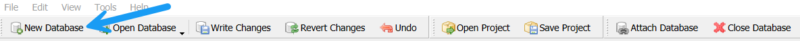

Select a folder location on your computer and name the new database `employee_small` and click Save.

{: .note }

MySQL has a **very large** Employee Sample database and all information about this resource can be found [here](https://dev.mysql.com/doc/employee/en/). Hence, the `employee_small` naming convention used for this demo.

Click on the Execute SQL button in DB Browser and open the `p2_create_employee_small_database.sql` file. Click on the Execute button to run all SQL statements to create all tables. Click on the Database Structure button and confirm that you have all 8 tables.

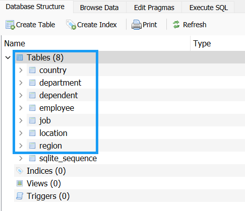

## Part 2: Load Database from Files

Here is the ERD for our version:

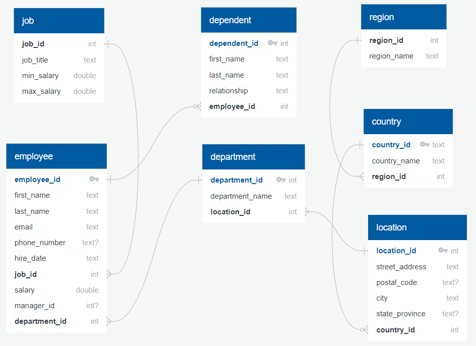

In the day [5_SQLite_Intro](../demos/5_SQLite_Intro.html) demo, we used an IMDb database that was preloaded with data. However, you will often need to load a database with data from an external source. pgAdmin and DB Browser both have the functionality to import data from a comma separated values (csv) file. pgAdmin also has a command line utility to copy data from a file to a table. In the resource files, there are .csv files for each of the 7 tables. Since the database as foreign key references, the order that you import the data is **important**. Therefore, we will load the tables in the following order:

1. region
2. country
3. location
4. department
5. job
6. employee
7. dependent

Click on File > Import > Table From CSV file...

Browse to the location on your computer that you saved the resource files and select the `region.csv` file. By default, DB Browser will populate the Table name with the name of the file. Since the csv files match the database tables exactly, you do not need to change the Table name. You should not need to change any other settings. 

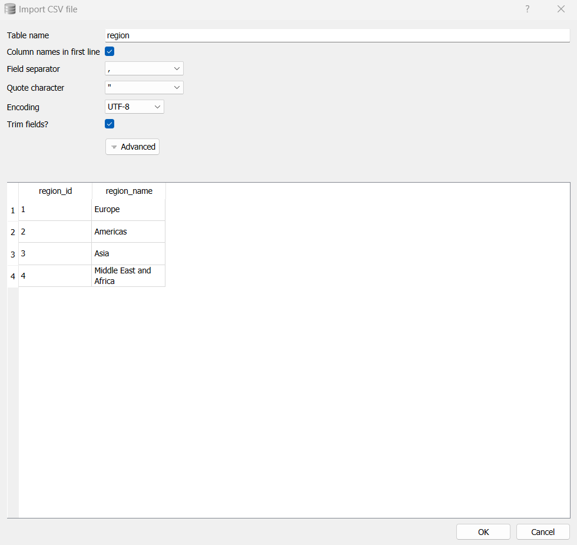

Click on OK. Since the database already has a table named `region`, you will get a message asking if you want to import the data into it? Click on Yes. 

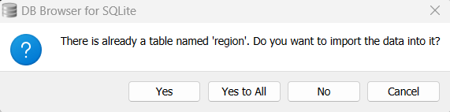

Validate that the table was loaded by running the following SQL statement or you can use the Browse Data tab and select the `region` table.

``` sql
SELECT *
FROM region
```

Repeat the steps for each of the remaining 6 tables.

## Part 3: Questions

### Directions
Write a SQL statement for each of the following questions. A sample output is provided for each question and for this demo includes all rows. **The output columns in your query must match the sample output exactly.**

**Question 1**

Write a query that returns the total number of employees for the company.

``` sql
SELECT
  COUNT(*) AS employee_cnt
FROM
  employee;
```

**Sample Output:**  

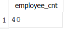

Copy and paste the code into the `submission.yaml` file for Question 1.
   
**Question 2**

Write a query that returns the minimum, maximum, and average salary for all employees in the company.

``` sql
SELECT
  MIN(salary) AS salary_min,
  MAX(salary) AS salary_max,
  AVG(salary) AS salary_avg
FROM
  employee;
```
   
**Sample Output:**  

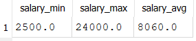  

Copy and paste the code into the `submission.yaml` file for Question 2.
   
**Question 3**

Write a query that returns the employee with the Programmer title that has the lowest salary.

``` sql
SELECT
  e.employee_id,
  e.first_name,
  e.last_name,
  e.salary,
  j.job_title
FROM
  employee e
  INNER JOIN job j ON e.job_id = j.job_id
WHERE
  j.job_title = 'Programmer'
ORDER BY
  e.salary
LIMIT
  1;
```
   
**Sample Output:**  

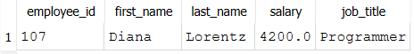 

Copy and paste the code into the `submission.yaml` file for Question 3.
   
**Question 4**

Write a query that returns all employees that make less than 50% of their max salary for the job title and order the results by their salary in ascending order.

``` sql
SELECT
  e.employee_id,
  e.first_name,
  e.last_name,
  e.salary,
  j.job_title,
  j.max_salary AS job_max_salary
FROM
  employee e
  INNER JOIN job j ON e.job_id = j.job_id
WHERE
  e.salary < j.max_salary * .50
ORDER BY
  e.salary;
```
   
**Sample Output:**  

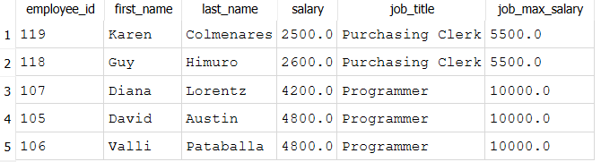

Copy and paste the code into the `submission.yaml` file for Question 4.
   
**Question 5**

Write a query that returns the minimum, maximum, and average salary in each department and order the results by average salary in descending order. Round the average salary to 2 decimal places.

``` sql
SELECT
  d.department_name,
  MIN(salary) AS dept_min_salary,
  MAX(salary) AS dept_max_salary,
  ROUND(AVG(salary),2) AS dept_avg_salary,
  COUNT(e.employee_id) AS employee_cnt
FROM
  employee e
  INNER JOIN department d ON e.department_id = d.department_id
GROUP BY
  d.department_name
ORDER BY
  dept_avg_salary DESC;
```
   
**Sample Output:**  

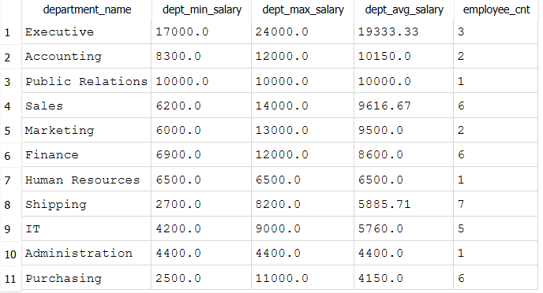

Copy and paste the code into the `submission.yaml` file for Question 5.

{: .note }
Only the first 5 questions will be used in this demo for the Gradescope autograder submission.
   
**Question 6**

Write a query that returns the minimum, maximum, and average salary in each department with at least 5 employees and order the results by average salary in descending order. Round the average salary to 2 decimal places.
   
**Sample Output:**  

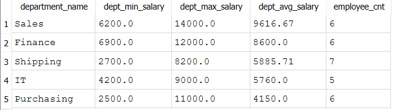
   
**Question 7**

Write a query that returns the number of dependents per employee in the Sales and Executive departments. Employees that have no dependents should be zero and order the results by the number of dependents in descending order.
   
**Sample Output:**  

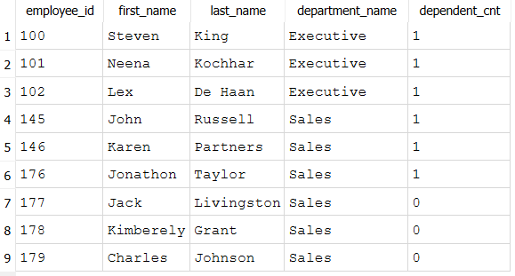

**Question 8**

Write a query that returns the number of employees by region and country with locations not in the United States and Canada and order the results by the number of employees in descending order.

**Sample Output:**  

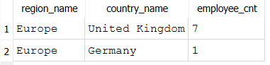

## Conclusion

In this demo, we used DB Browser to create a database, load the tables with data from .csv files and then write some queries to answer some interesting questions about the data. 