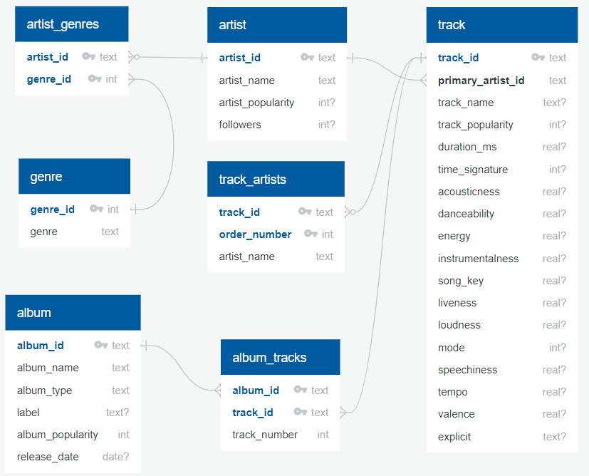
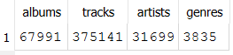

# Transform and Load Data Lab

In this lab, you will be using SQL to transform raw Spotify music data containing information about an album, artist(s), tracks, and genre(s) all in a single table into a relational database. In practice, there are ETL (Extract, Transform, and Load) tools to handle similar tasks but we will be leveraging our new SQL skills to handle the job.

Click [here](https://drive.google.com/file/d/1NTxS9HZQSyYsu-fCnXICn3yLKNTLslCj/view?usp=sharing) to download all resources needed for the lab as well as `HW5_Advanced_SQL`. Here is a summary of the contents in the `music_resources.zip` file:

1. `music` database with all tables created but no rows.
2. The `stage_music_data` table has been pre-loaded with 375,141 rows of data.
3. The `transform_load_music_data_student.sql` file is where you will be writing all of your SQL code to transform and load the data into the database tables.
4. The `submission.yaml` file for the one question that you need to submit to validate all of your data has been loaded.

Here is an ERD for the `music` database:



{: .acknowledgment }

The original version of this data came from the [Spotify Web API](https://developer.spotify.com/documentation/web-api) but the raw data used to load into the stage table came courtesy of this [Kaggle dataset](https://www.kaggle.com/datasets/tonygordonjr/spotify-dataset-2023).

## Part 1: Load Music Database

In HW3_CRUD_Operations as well as the the day 6_CRUD_Operations lab, you created new data by writing simple `INSERT INTO` statements 1 row at a time. In this lab, you will be loading the tables with `INSERT INTO` statements but instead of `VALUES()`, you will be using a `SELECT` statement. Here is a generic example:

``` sql
INSERT INTO table (column1, column2) 
SELECT
  source_data1 as column1,
  source_data2 as column2
FROM source_table;
```

Open the `transform_load_music_data_student.sql` file and complete all of the tasks in the Part 2: Transform and Load Tables section. 

{: .important }
Do **NOT** make any changes in the Part 1: Drop and Create Tables section as well as the SQL that creates the indexes after the data is loaded in each table.

## Part 2: Validate Data

| Table           | Description                                                                         | Rows      |
|:----------------|:------------------------------------------------------------------------------------|:----------|
| `album`         | Album specific information such as name, label, popularity, and release date.       | 67,991    |
| `album_tracks`  | Track order data for each album.                                                    | 375,141   |
| `artist`        | Artist specific information such as name, popularity, and number of followers.      | 31,699    |
| `artist_genres` | All genres that an artist is associated with if any.                                | 18,455    |
| `genre`         | Genre names for all artists.                                                        | 3,835     |
| `track`         | Track information including name, popularity, duration, and all Spotify metrics.    | 375,141   |
| `track_artists` | All artists that are associated with a track.                                       | 520,428   |

Write some simple `SELECT COUNT(*)` SQL statements and confirm the number of rows in your database matches the above. Here is an example for the `album` table:

``` sql
SELECT COUNT(*) AS albums FROM album;
```

## Part 3: Lab Submission

There is only 1 query that you need to submit for the autograder part of the lab in addition to the completed `transform_load_music_data_student.sql` SQL script.

**Question 1**

Write a query that returns the unique number of albums, tracks, artists, and genres in a single **SELECT** statement.

**Sample Output:**  



Copy and paste your code into the `submission.yaml` file for Question 1.

{: .tip }

Carefully consider what table you use as your primary table in the `FROM` clause and whether you should use an `INNER JOIN` or `LEFT JOIN` for all other tables.

## Submission

Submit the completed `transform_load_music_data_student.sql` script and the `submission.yaml` file on Canvas/Gradescope.