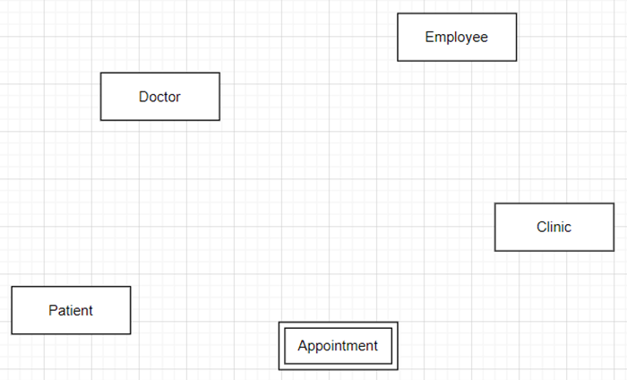

# 2_ERD_Demo

## Background
SD-Med is a small, family-owned doctor's office that has been serving a suburban community for over 20 years. The clinic has developed a substantial patient base, but it currently relies on a paper-based system to manage patient records, appointment scheduling, and other operational tasks. Recognizing the need to modernize, SD-Med plans to implement a comprehensive digital database system. This transition aims to enhance operational efficiency, improve data accuracy, and ultimately provide better patient care.

> [!NOTE]
> We will only consider entity relationship data modeling concepts for this business scenario and disregard any HIPAA or privacy constraint. Certain aspects of this example have been shortened for the purposes of this lab exercise and not intended to be a complete depiction of a real-world medical clinic.  

## Business Requirements

After a series of in-depth interviews with staff, owners and doctors, we have identified the following requirements.  

