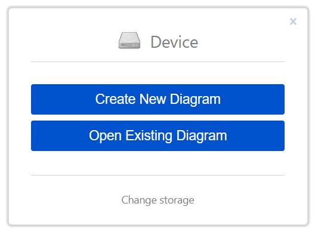
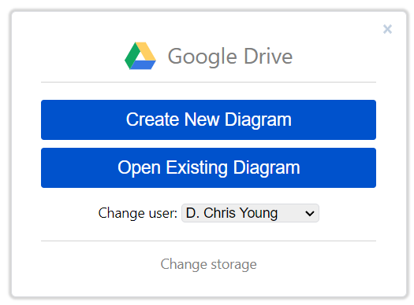
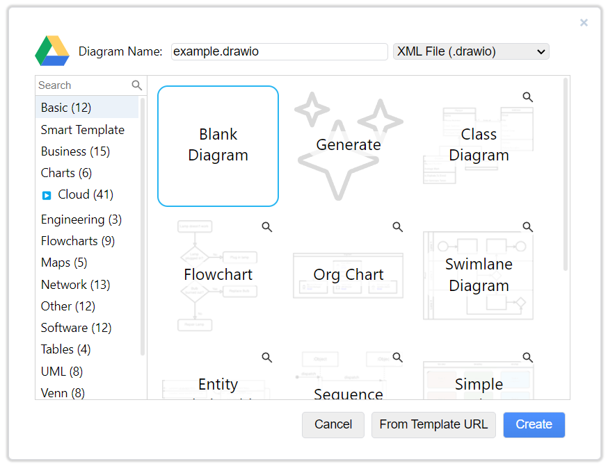
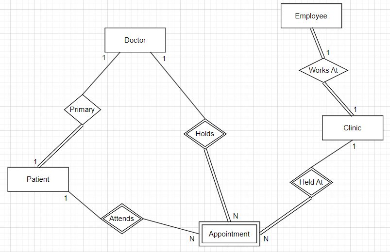
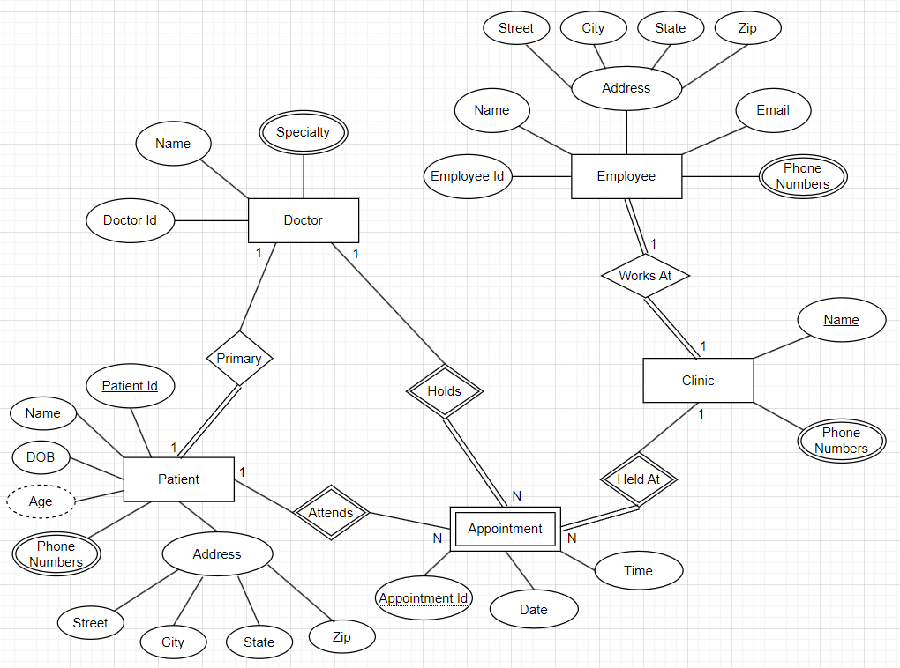

# ERD Demo

## Background

SD-Med is a small, family-owned doctor's clinic that has been serving the community for over 20 years. The clinic has developed a substantial patient base, but it currently relies on a paper-based system to manage patient records, appointment scheduling, and other operational tasks. Recognizing the need to modernize, SD-Med plans to implement a comprehensive digital database system. This transition aims to enhance operational efficiency, improve data accuracy, and ultimately provide better patient care.

{: .note }
We will only consider entity relationship data modeling concepts for this business scenario and ignore any potential HIPAA or privacy related constraints. Certain aspects of this example have been abbreviated for the purposes of this lab exercise. The scenario is not intended to represent a complete depiction of a real-world medical clinic.

## Business Requirements

After a series of in-depth interviews with staff, owners and doctors, we have identified the following requirements.

1. Each **clinic has employees**, such as administrators, nurses, maintenance staff, etc and an employee can only *work at* a single clinic.  
   1. **Clinic** information includes the name of the clinic that is how employees refer to each location and phone numbers.  
   2. **Employee** information includes a unique employee identifier that is assigned by the company, name, address (street, city, state and zip), email address, phone numbers  
2. **Doctors** have multiple specialties and can *hold* appointments at different clinics as needed for demand and patient need.  
   1. Doctor information also includes its unique medical identification number, name, and specialty.  
3. **Patients** must have a *primary* doctor but can have appointments with any specialist. However, some doctors may not provide primary care.  
   1. Patient information includes a unique patient identifier created by the clinic, name, date of birth, age, phone numbers, and address (street, city, state and zip).  
4. **Appointments** are *held at* a single clinic and patient vitals are obtained such as blood pressure, heart rate and weight as well as the notes from the doctor.  
   1. Appointment information also includes a unique identifier for the schedule and the date and time the appointment occurred.

## Before Getting Started

1. **Understand the Business Context**: Before jumping into the diagram tool, thoroughly understand the business requirements and make notes of the real-world entities relevant for SD-Med.  
2. **Identify all Entities**: Make note of potential strong and weak entities.  
3. **Consider Relationships**: Identify in the requirements potential relationships that are one-to-one, one-to-many or many-to-many.  
4. **Identify all Attributes**: Make note of simple vs. composite attributes, single vs. multi-valued attributes, if the business requirements referenced any derived attributes as well as any potential key attributes.  
   

## Chen Notation Symbol Quick Reference

## Create New Diagram

1. Go to [draw.io (app.diagrams.net)](https://app.diagrams.net/).

2. Click on Change storage and then choose one of the cloud storage options such as Google Drive, OneDrive or Dropbox and authorize the app (if needed).

3. Click on the blue Create New Diagram button. Give the diagram a meaningful name in the top left, select Blank Diagram and click on Create.

4. Confirm options and click on Save.

 💡 **Tips**

1. Place all entities on the blank diagram first.  
2. Connect entities with their relationships but don’t worry about getting the cardinality correct on the first attempt.  
   1. You can always update the cardinality symbols on the relationship lines later.  
3. You may find that you need to rearrange the diagram a little so it flows well and you have enough space before adding the attributes to the diagram.  
   1. The auto rearrange layout option may not work very well so it is good to do some preliminary organization at this point.  
4. Place all attributes on the diagram first and then connect attributes with their entities.

## Create Entities

Create rectangles for each entity. Be sure to distinguish weak entities that are dependent on a strong entity. In this business scenario, an appointment is the only weak entity since in order to uniquely identify the appointment it would require the key attribute for patient, clinic, and doctor.

{: .note }

All applicable objects can be found under the Entity Relation Shapes section.

## Create Relationships

Create diamonds for each relationship. Connect entities with their relationship lines and corresponding cardinality (1, M, N). A relationship that is total participation uses double lines but you can always update that later. 

{: .note }

Recall relationships between a weak and strong entity will always have a diamond with double lines to form the identifying relationship. The relationship between a weak entity and the identifying relationship will always be total participation.

## Create Attributes

Create ovals for all attributes around the corresponding entity and connect to the entity with a solid line.

{: .note }

Recall key attributes will have a solid underline whereas a partial key attribute will have a dashed underline, multi-valued attributes will have an oval with double lines, derived attributes will have an oval with dashed lines.

## Conclusion

In this demo, we analyzed business requirements for SD-Med and created an entity-relationship diagram (ERD) to serve as the conceptual data model.
