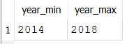
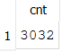
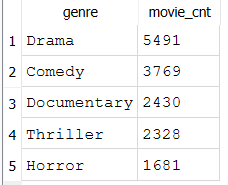
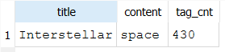

# Intermediate SQL Lab

In this lab, you will be working with the `movie` database that you designed in `HW2_Create_Database`. Click [here](https://drive.google.com/file/d/1qAeXiKPoK3jHewLb6fK2dcWDQ2pKxlOt/view?usp=sharing) to download all resources needed for the lab as well as `HW4_Intermediate_SQL`. In the resources file, we have included a SQLite `movie_small.db` file that you can use with DB Browser. This database is ready to go so you can skip to Part 2 to work on your queries for the 4 questions required for the lab. The main purpose of this lab is to utilize class time to get you started with the `movie` database required for `HW4_Intermediate_SQL` and provide assistance with any SQL syntax questions that you may have.

{: .important }

For some of the `HW4_Intermediate_SQL` questions, you may experience a noticeable performance difference between pgAdmin and DB Browser. At home, follow the steps in Part 1 to create and load the `movie` database in pgAdmin.

## Part 1: Create Movie Database

### Create Database

Since you may have named your columns slightly different in `HW2_Create_Database`, we have also provided `create_movie_db.sql` file in the resources that you can use to create a new fresh copy of the database. This way your database schema will match the header row for all `.csv` files and the expected columns for `HW4_Intermediate_SQL`. Follow these steps to create the database and tables in pgAdmin.

1. Create a new database and name it `movie_small`
2. Open a new Query Tool window for the `movie_small` database
3. Open the `create_movie_db.sql` file and Execute the script
4. Refresh the database and validate that you see the 7 tables in the Schema

### Upload Data

We will be working with a "smaller" version of the movie dataset collected from the [MovieLens](https://movielens.org/) website. Therefore, some of the `.csv` files will have the suffix `_small.csv`. Refer to the table below that matches the `.csv` file with the respective database table.

| **Table Name** | **`.csv` file**        |
|:--------------:|:----------------------:|
| movie          | movie_small.csv        |
| genre          | genre.csv              |
| tag            | tag.csv                |
| users          | users.csv              |
| ratings        | ratings_small.csv      |
| movie_genres   | movie_genres_small.csv |
| movie_tags     | movie_tags_small.csv   |

pgAdmin has a similar graphical interface to import data from a file to an existing table. Click [here](https://learnsql.com/blog/how-to-import-csv-to-postgresql/) to read about how to import csv files to PostgreSQL using either the graphical interface or the `COPY` psql command. This lab will not include detailed instructions on the Import/Export Data graphical interface in pgAdmin.

{: .warning }

The delimiter for the .csv files is a \| and the first row is the header with column names.

If you decide to use the psql command to load the data, below are some things to consider:

* For Windows, you will need to escape your slashes so use `C:\\path\\to\\local\\filename.csv`.  
* For macOS, use `/path/to/local/filename.csv`.

Here is an example COPY command for the `genre` table:

```
\COPY genre FROM '<path><filename>' DELIMITER '<delimiter>' CSV HEADER ENCODING 'UTF8';
```

## Part 2: Write Queries

### Question 1

Write a query that returns the minimum and maximum year for all movies.



Copy and paste your code into the `submission.yaml` file for Question 1.

### Question 2

Write a query that shows how many movies are in the database for the year 2015.



Copy and paste your code into the `submission.yaml` file for Question 2.

### Question 3

Write a query that shows the top 5 movie genres based on the total number of movies.



Copy and paste your code into the `submission.yaml` file for Question 3.

### Question 4

Write a query that shows the movie and tag content that has largest number of tags.



Copy and paste your code into the `submission.yaml` file for Question 4.

{: .important }

The Gradescope autograder uses a SQLite database so you must ensure your SQL is compatible with SQLite. Several questions in `HW4_Intermediate_SQL` may require slightly different versions between PostgreSQL and SQLite.

## Submission

Submit the completed `submission.yaml` file on Canvas/Gradescope.


